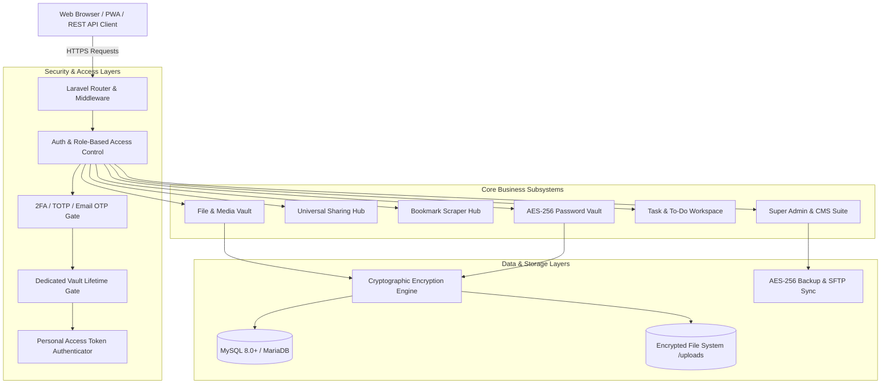
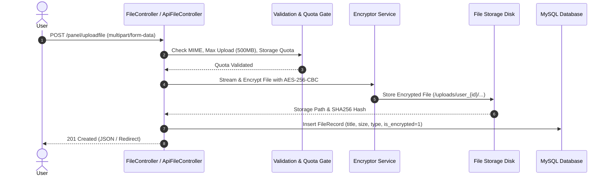
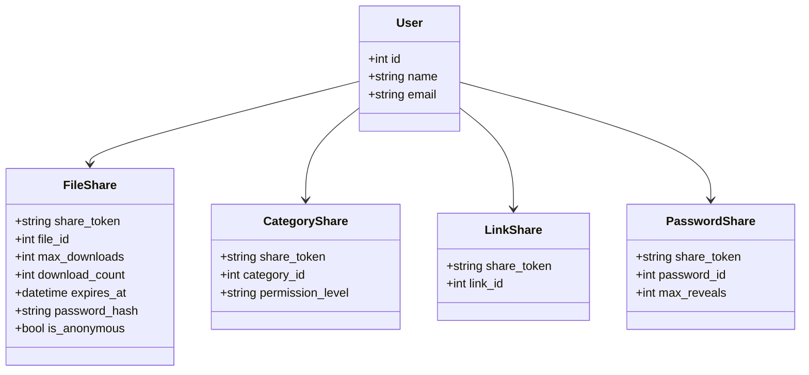

# 📘 FileFusion — Complete Architectural Deep-Dive & Developer Case Study

> **Audience**: Backend & Full-Stack Engineers, Security Architects, DevOps Engineers, and AI Agents maintaining or extending the FileFusion codebase.  
> **Repository Context**: Self-hosted, privacy-first personal cloud workspace, digital asset manager, task workspace, and zero-knowledge encrypted credential vault built on **Laravel 11.x/12.x**, **MySQL/MariaDB**, and **Vanilla CSS Design Engine**.

---

## 📑 Table of Contents

1. [System Architecture & Core Philosophy](#1-system-architecture--core-philosophy)
2. [Cryptographic Core & Encryption Engine](#2-cryptographic-core--encryption-engine)
   - 2.1 File-Level Envelope Encryption (AES-256-CBC)
   - 2.2 Password Vault & JIT (Just-In-Time) Decryption
   - 2.3 Anti-Enumeration & Anti-IDOR Encrypted Resource Identifiers
   - 2.4 Zero-Downtime Master Key Rotation Architecture
3. [File Ingestion, Streaming & Upload Pipeline](#3-file-ingestion-streaming--upload-pipeline)
   - 3.1 Upload Flow & On-the-Fly Cipher Generation
   - 3.2 Secure Memory-Efficient Streaming & Decryption
   - 3.3 Storage Quotas, Orphan Cleaner & Soft Trash Policies
4. [Web Bookmark & Link Scraper Subsystem](#4-web-bookmark--link-scraper-subsystem)
   - 4.1 Automated Metadata & Favicon Scraper
   - 4.2 Decrypted Attribute Aliasing (`Links` Model Architecture)
5. [Universal Multi-Resource Sharing Suite](#5-universal-multi-resource-sharing-suite)
   - 5.1 Sharing Matrix & Polymorphic Models
   - 5.2 1-Time Self-Destruct Links & Expiration Engine
   - 5.3 Passcode Protection & User-to-User Delegation
6. [Task & To-Do Workspace Subsystem](#6-task--to-do-workspace-subsystem)
   - 6.1 Hierarchical Checklist & Step Progress Calculation
   - 6.2 Visual Calendar Deadlines & Hidden Vault Integration
7. [Developer REST API & Token Security](#7-developer-rest-api--token-security)
   - 7.1 Personal Access Token (PAT) Lifecycle
   - 7.2 Granular Ability Scopes & Rate Limiting
   - 7.3 Model Context Protocol (MCP) & AI Agent Integration
8. [Super Admin Console, CMS & Disaster Recovery](#8-super-admin-console-cms--disaster-recovery)
   - 8.1 Administrative Control Suite & RBAC
   - 8.2 Landing Page & SMTP Email Template CMS
   - 8.3 Disaster Recovery Backup Engine & Automated Crons
   - 8.4 Forensic Audit Trail & Real-Time Telemetry
9. [Native Android Mobile Architecture](#9-native-android-mobile-architecture)
   - 9.1 Ergonomic Mobile Navigation & Bottom Drawer
   - 9.2 Universal Hardware Back-Button Router
   - 9.3 3-Layer Tactile Haptic Engine
   - 9.4 Touch Hygiene & Zero-Latency Taps
10. [Testing Harness & Verification Guidelines](#10-testing-harness--verification-guidelines)
   - 10.1 Test Script Organization (`antigravity_testfiles/`)
   - 10.2 In-Browser API Playground (`/api-tester`)
11. [Critical Gotchas & Developer Rules of Engagement](#11-critical-gotchas--developer-rules-of-engagement)

---

## 1. System Architecture & Core Philosophy

FileFusion is architected around **Zero-Knowledge Data Segregation**, **Defense-in-Depth**, and **Modular Performance**.



### Core Architectural Axioms
1. **Never Store Secrets in Cleartext**: Passwords, recovery codes, and files on disk are always AES-256 encrypted.
2. **No IDOR / Enumeration Vulnerabilities**: Numeric database auto-increment IDs (`1, 2, 3`) are never directly exposed in public endpoints or client URLs. All public and API identifiers are encrypted strings.
3. **Decryption Must Be Ephemeral**: Uploaded files are decrypted *on-the-fly during HTTP streaming*. The unencrypted file is never written to disk.
4. **Resilience & Zero Layout Shifts**: The UI utilizes a bespoke CSS Design System (`resources/css/filefusion.css`) with theme-adaptive CSS custom properties for instant dark/light switching and zero layout shift.

---

## 2. Cryptographic Core & Encryption Engine

### 2.1 File-Level Envelope Encryption (AES-256-CBC)

File uploads in FileFusion undergo **Envelope Encryption** before touching physical disk storage:

```
[Raw File Payload]
         │
         ▼
[Generate Random 256-bit IV]
         │
         ▼
[AES-256-CBC Cipher with Master Key: FILE_ENCRYPTION_KEY]
         │
         ▼
[Binary Encrypted File Stream] ──► Written to /uploads/{user_id}/{filename}.enc
```

- **Helper Class**: `App\Helpers\Encryptor.php`
- **Algorithm**: `AES-256-CBC` with OpenSSL.
- **Key Derivation**: Generated from `env('FILE_ENCRYPTION_KEY')` (or derived from `APP_KEY` if not explicitly specified).
- **IV Handling**: A unique, cryptographically random 16-byte initialization vector (`openssl_random_pseudo_bytes(16)`) is prefixed or bound to each encrypted file chunk, ensuring identical files produce distinct ciphertext.

### 2.2 Password Vault & JIT (Just-In-Time) Decryption

All credential vault entries (`App\Models\Password`) encrypt the `password`, `notes`, and `custom_fields` attributes in MySQL:

- **Storage**: Masked string in database (`eyJpdiI6...`).
- **Default Output**: Masked with bullet dots (`••••••••`) across all index views, search results, and API listings.
- **JIT Decryption Flow**:
  1. User clicks the eye icon or API calls `POST /api/v1/vault/reveal/{id}`.
  2. Server verifies user session and Dedicated Vault Unlock status.
  3. Decrypts field in memory and returns cleartext with a time-to-live (TTL) timestamp.
  4. Client-side JS automatically re-masks the secret when the timer expires.
  5. An audit log entry (`App\Models\ActivityLog`) is recorded with timestamp, IP, and user-agent.

### 2.3 Anti-Enumeration & Anti-IDOR Encrypted Resource Identifiers

To prevent sequential ID scraping (IDOR attacks), FileFusion utilizes bidirectional ID encryption:

```php
// Outgoing API / View Response:
$encryptedId = Crypt::encryptString((string) $model->id);

// Incoming Request Resolution:
try {
    $numericId = (int) Crypt::decryptString($request->route('id'));
} catch (DecryptException $e) {
    // Fallback support for numeric IDs in debug environments
    $numericId = (int) $request->route('id');
}
```

### 2.4 Zero-Downtime Master Key Rotation Architecture

When an enterprise rotates its encryption key:
1. Update `FILE_ENCRYPTION_KEY` in `.env` to the new version.
2. Append the previous key to `FILE_PREVIOUS_KEYS` (comma-separated list).
3. The `Encryptor` helper checks current key version first; if decryption fails, it gracefully cascades through `FILE_PREVIOUS_KEYS`.
4. Automated re-encryption CLI command: `php artisan vault:re-encrypt` iterates through database models and rewrites ciphertext with the current active key.

---

## 3. File Ingestion, Streaming & Upload Pipeline

### 3.1 Upload Flow & On-the-Fly Cipher Generation



### 3.2 Secure Memory-Efficient Streaming & Decryption

When a user downloads or previews a 500MB video or PDF, reading the entire decrypted file into PHP memory would cause `Memory Limit Exceeded (Fatal Error)`.

**FileFusion Solution**:
- Uses **Chunked Streamed Responses** (`Symfony\Component\HttpFoundation\StreamedResponse`).
- Reads the encrypted file in 64KB chunks, decrypts on-the-fly, and flushes output buffers directly to the browser client.
- Strict security headers attached to every file download:
  ```http
  Content-Disposition: attachment; filename="decrypted_document.pdf"
  X-Content-Type-Options: nosniff
  Cache-Control: private, no-transform, no-cache
  ```

### 3.3 Storage Quotas, Orphan Cleaner & Soft Trash Policies

1. **Storage Pool Calculation**:
   - Storage usage is calculated via aggregate query: `SELECT SUM(size_bytes) FROM files WHERE user_id = ? AND is_trashed = 0`.
   - Admin can assign granular quotas per user: Free (5GB), Pro (50GB), Manager (200GB), Admin (Unlimited).
2. **Storage Cleaner Subsystem (`/panel/storage-cleaner`)**:
   - Scans physical `/uploads` directories against database file paths.
   - Identifies orphaned files (files deleted from DB due to aborted transactions).
   - Allows safe 1-click purge without database corruption.
3. **Soft Trash Retention**:
   - Trashed files are kept for 30 days (`is_trashed = 1`, `trashed_at = timestamp`).
   - Automated cleanup job permanently deletes expired trash items and dispatches email notifications prior to permanent deletion.

---

## 4. Web Bookmark & Link Scraper Subsystem

### 4.1 Automated Metadata & Favicon Scraper

When a user pastes a URL (`https://github.com/laravel/laravel`):
1. `LinkController` initiates an HTTP request with custom User-Agent and timeout.
2. Extracts `<title>`, `<meta name="description">`, `<meta property="og:image">`, and `<link rel="icon">`.
3. Downloads high-resolution thumbnail to `public/thumbnails/links/` with randomized unique hash.
4. Generates instant QR code for mobile handoff.

### 4.2 Decrypted Attribute Aliasing (`Links` Model Architecture)

In the database, columns in `links` table are `title` and `url`.  
To prevent backward-compatibility bugs with legacy views, `App\Models\Links` implements dynamic attribute accessors:

```php
// app/Models/Links.php
public function getWebsiteTitleAttribute(): ?string
{
    return $this->title;
}

public function getWebsiteUrlAttribute(): ?string
{
    return $this->url;
}
```

---

## 5. Universal Multi-Resource Sharing Suite

FileFusion features a polymorphic universal sharing engine that supports **Files**, **Categories**, **Bookmark Collections**, and **Password Vaults**.



### 5.1 Sharing Modes & Policies

| Policy Type | Behavior | Security Features |
| :--- | :--- | :--- |
| **1-Time Single-Use Link** | Automatically self-destructs after 1 successful download | Database locks token immediately upon download initiation |
| **Expiring Public Link** | Valid for defined duration (15m, 1h, 24h, 7d) | Route middleware checks `expires_at < now()`, renders custom expired page |
| **PIN/Passcode Gate** | Requires guest to enter secret PIN | Gated view with brute-force rate limiter (`throttle:5,1`) |
| **Private User Delegation**| Accessible only by designated registered user | Verifies `Auth::id() === $share->recipient_user_id` |
| **Anonymous Transfer** | Hides owner username/email from guest download page | Strips all owner metadata from template payload |

---

## 6. Task & To-Do Workspace Subsystem

The task management subsystem provides a structured workflow for projects, sprint milestones, and personal productivity.

### 6.1 Hierarchical Checklist & Step Progress Calculation

- **Models**:
  - `App\Models\TodoCollection`: Parent workspace/project with custom cover colors and category tags.
  - `App\Models\TodoTask`: Main task item with due dates, priority stars, notes, and tags.
  - `App\Models\TodoStep`: Sub-action items / checklists belonging to a task.
- **Dynamic Progress Calculation**:
  $$\text{Progress \%} = \left( \frac{\text{Completed Steps}}{\text{Total Steps}} \right) \times 100$$
  When all sub-steps are checked, the parent task status is automatically updated.

### 6.2 Visual Calendar Deadlines & Hidden Vault

- **Calendar Engine (`/panel/todos/calendar`)**: Renders interactive month and week views highlighting upcoming, due today, and overdue tasks with urgency color badges.
- **Hidden Vault To-Dos**: Tasks flagged with `is_hidden = 1` are excluded from standard views and accessible only after entering the Master Vault PIN.

---

## 7. Developer REST API & Token Security

FileFusion provides a REST API v1 for third-party integrations, mobile clients, and AI Model Context Protocol (MCP) servers.

- **Base URL**: `/api/v1`
- **Documentation**: Located in [`api_documentation/`](file:///d:/Ashish/Web/filesystem/New%20Filesystem/laravel/api_documentation/)
- **Postman Collection**: [`api_documentation/FileFusion_API_v1.postman_collection.json`](file:///d:/Ashish/Web/filesystem/New%20Filesystem/laravel/api_documentation/FileFusion_API_v1.postman_collection.json)

### 7.1 Personal Access Token (PAT) Lifecycle

```
[User Generates Token in UI] 
          │
          ▼
[Generates Plaintext: ff_live_{tokenId}.{secretHash}]
          │
          ▼
[Stores SHA-256 Hashed Secret in DB: api_tokens table]
          │
          ▼
[Returns Plaintext ONCE to User]
```

- **Authentication Middleware**: `App\Http\Middleware\AuthenticateApiToken.php` validates `Authorization: Bearer ff_live_...` or header `X-API-TOKEN`.
- **Token Ability Scopes**:
  - `*`: Full administrative and data access.
  - `files:read`, `files:write`, `files:delete`
  - `links:read`, `links:write`, `links:delete`
  - `vault:read` (masked passwords), `vault:reveal` (JIT decrypt)
  - `todos:read`, `todos:write`, `todos:delete`
  - `admin:users`, `admin:system`

---

## 8. Super Admin Console, CMS & Disaster Recovery

The Super Admin Console (`/panel/admin/*`) is restricted to users with `role === 'super_admin'`.

### 8.1 Administrative Suite Overview

```
resources/views/panel/admin/
├── dashboard.blade.php        # Global KPIs, storage consumption, user activity
├── users.blade.php            # User manager, role allocation, quota adjustment, API toggles
├── files.blade.php            # Global file audit table across all accounts
├── links.blade.php            # Decrypted global bookmark audit console
├── storage.blade.php          # Storage pool analytics and batch quota allocator
├── settings.blade.php         # Platform branding, registration gates, default quotas
├── backups.blade.php          # 3-tier disaster recovery backup engine
├── email_settings.blade.php   # Live SMTP credentials tester and Email Template CMS
├── landing_page.blade.php     # Homepage hero banners, feature grids, and SEO CMS
└── activity-logs.blade.php    # Forensic audit stream with IP and user-agent filters
### 8.2 Disaster Recovery Backup Engine & Automated Crons

1. **Database Snapshot (`BackupService::createDbBackup()`)**: Generates full `.sql` dump using native PDO chunking and compresses into `backup_db_*.zip`.
2. **Whole Site & Codebase Snapshot (`BackupService::createCodebaseBackup()`)**: Packages the complete site (HTML/Blade templates, application controllers, configuration, public assets, and database dump).
3. **Automated Staggered Daily Crons**:
   - `php artisan cron:backup:db` (Runs daily at `01:00 AM`).
   - `php artisan cron:backup:full` (Runs daily at `03:30 AM`).
   - Also exposed via secure HTTP webhooks (`/cron/backup-db`, `/cron/backup-full`).
4. **Offsite Replication**: Automatically dispatches backup archives to remote FTP & SFTP storage servers with local archive retention.

---

## 9. Native Android Mobile Architecture (Capacitor & Web Engine)

FileFusion provides a first-class mobile app experience by combining a modern Blade frontend with Android native hardware integration:

### 9.1 Ergonomic Mobile Navigation & Bottom Drawer
- **5-Tab Floating Bottom Navigation Bar (`mobile_bottom_nav.blade.php`)**: Provides thumb-accessible navigation (`Home`, `Files`, `Links`, `Vault`, `Private`) with active glow pills and safe-area inset compensation.
- **Slide-up Mobile Action Drawer (`ffGlobalBottomSheet`)**: High-performance bottom action sheet with smooth transitions and backdrop blur.

### 9.2 Universal Hardware Back-Button Router (`app.js`)
Intercepts Android system back gestures using `@capacitor/app` (`App.addListener('backButton')`) with strict layered dismissals:
$$\text{Active Bottom Sheet} \longrightarrow \text{Open Modals} \longrightarrow \text{Dropdowns} \longrightarrow \text{Sidebar Drawer} \longrightarrow \text{History Back} \longrightarrow \text{Double-Tap to Exit Toast}$$

### 9.3 3-Layer Tactile Haptic Engine
- **Direct Java Bridge (`MainActivity.java`)**: Calls `FileFusionAndroidHaptics.vibrate(type)` directly through Android's `Vibrator` / `VibrationEffect` API, bypassing browser restrictions.
- **Capacitor Haptics Plugin (`@capacitor/haptics`)**: Integrates `Haptics.impact({ style: ImpactStyle.Light })` and `Haptics.notification()`.
- **Browser Standard Fallback**: `navigator.vibrate([20, 45, 40])` for Chrome / Firefox web clients.

### 9.4 Touch Hygiene & Zero-Latency Taps (`filefusion.css`)
- Stripped web artifacts: `-webkit-tap-highlight-color: transparent`, `overscroll-behavior-y: contain`.
- Instant responsiveness: `touch-action: manipulation` eliminates the 300ms mobile tap delay.
- Springy tactile feedback: `:active { transform: scale(0.965); }` on buttons, tiles, cards, and bottom tabs.

### 9.5 Native Android Clipboard Bridge & Resilient Clipboard Engine
- **Direct Java Clipboard Bridge (`MainActivity.java`)**: `@JavascriptInterface FileFusionAndroidClipboard.copy(text)` communicates directly with Android's `ClipboardManager` and `ClipData`, bypassing WebView security sandboxing and non-HTTPS LAN context restrictions.
- **Universal Resilient Clipboard Engine (`backend.blade.php`)**: `window.ff.copy(text)` and `fallbackCopy()` provide seamless copying with non-scrolling offscreen textareas across all mobile devices, desktop browsers, and HTTP staging environments.
- **Global Event Delegation**: Intercepts `.copy-link-btn`, `.copy-username-btn`, `.copy-password-btn`, `.copy-btn`, `.js-copy-hash`, and `[data-ff-copy]` with automatic haptic feedback.

---

## 10. Testing Harness & Verification Guidelines

All test scripts, security harnesses, and temporary verification utilities are strictly isolated in `antigravity_testfiles/` and ignored by git.

### 10.1 Test Files Catalog (`antigravity_testfiles/`)

- `test_encryption.php`: Validates AES-256 cipher integrity, IV uniqueness, and key cascade logic.
- `check_links.php`: Validates bookmark decryption, category relationships, and attribute accessor aliases.
- `set_admin_pw.php`: Safe administrative password reset utility using Argon2id/Bcrypt.
- `verify_shares.php`: Tests 1-time single-use download expiration and passcode verification gates.

### 9.2 Interactive API Playground (`/api-tester`)

- Browser-based testing console available at `http://127.0.0.1:8000/api-tester`.
- Allows instant token authentication, live endpoint execution, cURL snippet generation, and JSON payload inspection.

---

## 10. Critical Gotchas & Developer Rules of Engagement

### ⚠️ Gotchas & Pitfalls to Avoid

1. **NEVER Echo or Log Decrypted Passwords**:
   - Always keep passwords in masked format (`••••••••`). Decrypt only inside JIT reveal controller or during export.
2. **NEVER Bypass the Encryptor for File Storage**:
   - Always use `Encryptor::encryptFileStream()` before writing to disk. Writing unencrypted files to disk compromises compliance.
3. **Do NOT Hardcode Numeric Model IDs in JavaScript**:
   - Always use the encrypted string ID returned by server models (e.g. `data-id="{{ Crypt::encryptString($item->id) }}"`).
4. **Preserve Database Key Cascades on Key Rotation**:
   - When updating `FILE_ENCRYPTION_KEY`, always preserve existing keys in `FILE_PREVIOUS_KEYS`. Failing to do so permanently locks existing uploaded files.
5. **Vite Production Bundles**:
   - Whenever editing `resources/css/filefusion.css` or `resources/js/`, always compile production assets via `npm run build`.

---

## 🏁 Summary Checklist for New Developers

- [ ] Copy `.env.example` to `.env` and set `APP_KEY` + `FILE_ENCRYPTION_KEY`.
- [ ] Run `composer install` and `npm install && npm run build`.
- [ ] Run `php artisan migrate --seed` to create default schemas and Super Admin user.
- [ ] Explore the live UI at `http://127.0.0.1:8000` and API Tester at `/api-tester`.
- [ ] Review Postman endpoints in `api_documentation/FileFusion_API_v1.postman_collection.json`.
- [ ] Maintain changelogs and implementation plans in `agent_memory/` and `agent_plan/`.
