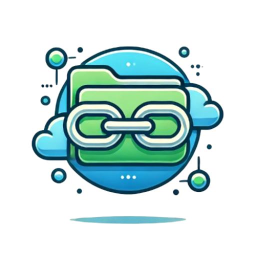

# ⚡ FileFusion — Modern Cloud Storage, Digital Asset & Encrypted Credential Vault

<p align="center">
  
</p>

<p align="center">
  <strong>An enterprise-grade, privacy-first personal cloud storage platform, digital bookmark hub, and zero-knowledge encrypted credential vault built with modern Laravel & rich UX aesthetics.</strong>
</p>

<p align="center">
  
  
  
  
  
  
</p>

---

## 📖 Table of Contents
1. [Overview](#-overview)
2. [Key Highlights & Features](#-key-highlights--features)
   - [📁 File & Media Management](#-file--media-management)
   - [🔗 Web Bookmark & Link Hub](#-web-bookmark--link-hub)
   - [🔑 Encrypted Password & Credential Vault](#-encrypted-password--credential-vault)
   - [🛡️ Security Architecture & 2FA](#-security-architecture--2fa)
   - [📦 Backup, Export & Disaster Recovery](#-backup-export--disaster-recovery)
   - [🎨 Design Engine & Theming](#-design-engine--theming)
3. [Technology Stack](#-technology-stack)
4. [Installation & Getting Started](#-installation--getting-started)
5. [Configuration & Environment](#-configuration--environment)
6. [Project Structure](#-project-structure)
7. [Security Practices](#-security-practices)
8. [License](#-license)

---

## 🌟 Overview

**FileFusion** is a self-hosted cloud workspace that brings together file storage, media galleries, bookmark management, and confidential password storage under a unified, beautiful, and secure web interface.

Designed for speed, reliability, and security, FileFusion provides instant global search, per-category filtering, auto-locking hidden vaults, two-factor authentication (TOTP/Email), automated AES-256 backup creation, and an administrative control suite with user quota management and audit activity logging.

---

## 🚀 Key Highlights & Features

### 📁 File & Media Management
* **Multi-Format Uploads**: High-performance asynchronous chunked/streamed uploads for documents, images, audio, video, archives, and code.
* **In-App Media Player & Previews**: Stream audio/video directly in the browser and preview PDF documents, code syntax, and high-resolution photos.
* **Smart Categorization & Tagging**: Organize items with customizable colored categories, nested tags, and custom metadata.
* **Bulk Operations**: Multi-select files for batch download, trash, permanent deletion, category assignment, or vault transfer.
* **Storage Quota Meters**: Visual progress bars and quota thresholds customized per user role (Free, Pro, Manager, Admin).
* **Storage Optimization**: Dedicated orphaned file cleaner to recover storage space without database corruption.

### 🔗 Web Bookmark & Link Hub
* **Metadata Scraper**: Automatically extracts page titles, descriptions, preview thumbnails, and favicons from pasted URLs.
* **Tagging & Filtering**: Quick-access tags, domain categorization, search filters, and favorite bookmark pins.
* **Sharing & QR Generation**: Generate instant QR codes and shareable landing links for any saved item.
* **Bulk Management**: Export bookmarks to standard JSON or HTML formats for easy portability across browsers.

### 🔑 Encrypted Password & Credential Vault
* **AES-256-CBC Field-Level Encryption**: All passwords, PINs, recovery codes, and custom fields are encrypted with distinct initialization vectors before storage.
* **JIT (Just-In-Time) On-Demand Reveal**: Secrets remain masked by default; clicking the eye icon triggers an authenticated reveal with configurable auto-mask timer.
* **Password Generator**: Configurable cryptographic generator with customizable character sets, lengths, and entropy strength score meter.
* **Custom Security Fields**: Attach custom key-value pairs (API keys, security questions, seed phrases, notes) to any credential item.

### 🛡️ Security Architecture & 2FA
* **Independent Hidden Vaults**: Dedicated hidden zones for Files, Links, and Passwords protected by an independent Passcode / Master PIN.
* **Configurable Session Lifetimes**: Independent timeout controls for Hidden Files, Hidden Links, Password Vault, and Secret Reveals, including:
  * `⚡ Immediate (Ask Always)`: Prompts on every page reload for high-security environments.
  * Time-based auto-lock intervals: `2m`, `5m`, `15m`, `30m`, `1h`, `2h`, `4h`, `8h`, `24h`.
  * Manual 1-click session extension badge.
* **Two-Factor Authentication (2FA)**:
  * **TOTP Authenticator Apps**: Google Authenticator, 1Password, Authy, Bitwarden.
  * **Email OTP Verification**: Fallback 6-digit one-time passcodes delivered via SMTP.
  * **Emergency Recovery Codes**: Printable single-use fallback codes.
  * **Granular Enforcements**: Choose to require 2FA on Login, on Vault Unlock, on Secret Reveals, or globally.
* **Role-Based Access Control (RBAC)**:
  * `Super Admin`, `Admin`, `Manager`, `Pro User`, `Standard User`.
  * User impersonation system with visual banner and safe 1-click exit.
* **Live Audit Log & Activity Monitor**: Real-time security event tracking with IP address resolution, user agent detection, and auto-refresh stream.

### 📦 Backup, Export & Disaster Recovery
* **Three Flexible Backup Types**:
  1. **Database Only**: Complete SQL database structure and data snapshot.
  2. **Files & Database**: Full user uploads directory combined with SQL database dump.
  3. **Full System Codebase**: Complete application backup including controllers, models, views, root configs (`composer.json`, `package.json`, `.env.example`, `artisan`), uploads, and database.
* **Zero-Knowledge Encryption**: Automatic password-protected AES-256 encrypted payload packaging for offsite storage.
* **One-Click Restoration**: Upload or select any past backup to restore database and files instantly.

### 🎨 Design Engine & Theming
* **Fluid Theme Engine**: Fast Light and Dark mode with persistent `localStorage` preference and zero layout shift on reload.
* **4 Accent Palettes**:
  * 🧱 `Terracotta` (`#d97757`)
  * 🌲 `Emerald` (`#2f9e6e`)
  * 🌊 `Teal` (`#1e9ca8`)
  * 🔮 `Indigo` (`#5b6fcf`)
* **Dynamic Palette-Adaptive Shadows**: Primary buttons, badges, and focus rings dynamically match your selected accent palette.
* **Responsive Collapsible Sidebar**: Auto-collapses to an icon-only mode (68px) on compact viewports with a persistent topbar toggle.
* **Dynamic Typography Scaling**: Real-time font size adjuster (85% to 130%) for accessibility.

---

## 🛠️ Technology Stack

| Layer | Technologies |
|---|---|
| **Backend** | PHP 8.2+, Laravel 11.x / 12.x, Eloquent ORM |
| **Frontend** | Blade Templates, ES6+ JavaScript, Vanilla CSS Design System, Vite |
| **Database** | MySQL 8.0+ / MariaDB / PostgreSQL / SQLite |
| **Icons & UI** | Lucide Icons, Google Fonts (Outfit & Inter) |
| **Security & Crypto** | OpenSSL AES-256-CBC, PragmaRX Google2FA, Argon2id / Bcrypt |
| **Archival & Media** | PHP ZipArchive, Intervention Image, FFMpeg (optional) |

---

## 💻 Installation & Getting Started

### Prerequisites
* **PHP**: `>= 8.2` with extensions (`bcmath`, `ctype`, `curl`, `dom`, `fileinfo`, `json`, `mbstring`, `openssl`, `pdo_mysql`, `tokenizer`, `xml`, `zip`)
* **Composer**: `>= 2.x`
* **Node.js**: `>= 18.x` & **npm**
* **Database**: MySQL `>= 8.0` or MariaDB `>= 10.4`

### Step-by-Step Setup

1. **Clone the Repository**:
   ```bash
   git clone https://github.com/your-username/filefusion.git
   cd filefusion/laravel
   ```

2. **Install PHP Dependencies**:
   ```bash
   composer install --no-dev --optimize-autoloader
   ```

3. **Install & Compile Frontend Assets**:
   ```bash
   npm install
   npm run build
   ```

4. **Environment Configuration**:
   ```bash
   cp .env.example .env
   php artisan key:generate
   ```

5. **Configure Database & Mail in `.env`**:
   ```env
   APP_NAME="FileFusion"
   APP_ENV=production
   APP_DEBUG=false
   APP_URL=http://localhost:8000

   DB_CONNECTION=mysql
   DB_HOST=127.0.0.1
   DB_PORT=3306
   DB_DATABASE=filefusion_db
   DB_USERNAME=root
   DB_PASSWORD=your_db_password

   MAIL_MAILER=smtp
   MAIL_HOST=smtp.mailtrap.io
   MAIL_PORT=2525
   MAIL_USERNAME=your_username
   MAIL_PASSWORD=your_password
   MAIL_ENCRYPTION=tls
   MAIL_FROM_ADDRESS="no-reply@filefusion.local"
   MAIL_FROM_NAME="${APP_NAME}"
   ```

6. **Run Database Migrations & Seeders**:
   ```bash
   php artisan migrate --seed
   ```

7. **Create Storage Symbolic Link**:
   ```bash
   php artisan storage:link
   ```

8. **Start the Application**:
   ```bash
   php artisan serve
   ```
   Visit `http://127.0.0.1:8000` in your web browser.

---

## ⚙️ Configuration & Environment

| Environment Key | Description | Default |
|---|---|---|
| `APP_NAME` | Name displayed across headers, emails, and brand mark | `FileFusion` |
| `MAX_UPLOAD_SIZE_MB` | Global max upload size per file (in Megabytes) | `500` |
| `DEFAULT_STORAGE_QUOTA_GB` | Default storage allocation for new users | `25` |
| `TWO_FACTOR_ISSUER` | Issuer name displayed in Google Authenticator | `FileFusion` |
| `BACKUP_STORAGE_DISK` | Storage disk for system backups | `local` |

---

## 📂 Project Structure

```
laravel/
├── app/
│   ├── Helpers/            # Formatting, setting, and string helpers
│   ├── Http/
│   │   ├── Controllers/    # File, Link, Password, Admin, and Setting controllers
│   │   └── Middleware/     # Auth, SuperAdmin, 2FA, and Session gates
│   ├── Models/             # User, File, Link, Password, ActivityLog, Category
│   └── Services/           # BackupService, AuditLogger, EncryptionEngine
├── config/                 # Application, auth, cache, and database configs
├── database/
│   ├── migrations/         # Schema definitions & lifetime enhancements
│   └── seeders/            # Super Admin & default category seeders
├── public/
│   ├── build/              # Compiled Vite production CSS & JS bundles
│   └── uploads/            # Encrypted / isolated user file directories
├── resources/
│   ├── css/
│   │   └── filefusion.css  # Core design system tokens, themes & layout rules
│   ├── js/                 # Client scripts & theme bootstrap
│   └── views/
│       ├── layout/         # Backend & frontend master shell templates
│       └── panel/          # Files, links, vault, settings, and admin views
└── routes/
    └── web.php             # Authenticated, public, API, and admin routes
```

---

## 🔒 Security Practices

* **Zero-Knowledge Field Storage**: Plaintext passwords and secret tokens are never written to disk or logs unencrypted.
* **Rate Limiting**: Critical endpoints (login, 2FA verify, password reveal, search queries) are protected with Laravel throttle middleware.
* **Auditability**: Every security-sensitive action (logins, impersonation, backup creation, deletion, password reveals) creates an immutable event in the `activity_logs` table.
* **Safe Content Serving**: Downloaded files are validated against MIME type mismatches with strict `Content-Disposition` headers to mitigate XSS vectors.

---

## 📄 License

This project is open-source software licensed under the **[MIT License](LICENSE)**. Feel free to use, modify, and distribute according to the terms.
